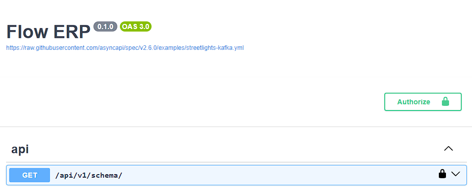

# Flow-ERP-schema

> <h3>Instructions: </h1>

- Copy contents of this file [Schema file](https://github.com/eslam5464/Flow-ERP-schema/blob/main/schema.yaml)
- Go to this link -> [Swagger editor](https://editor-next.swagger.io)
- Paste schema and it should be something like the image below

  
